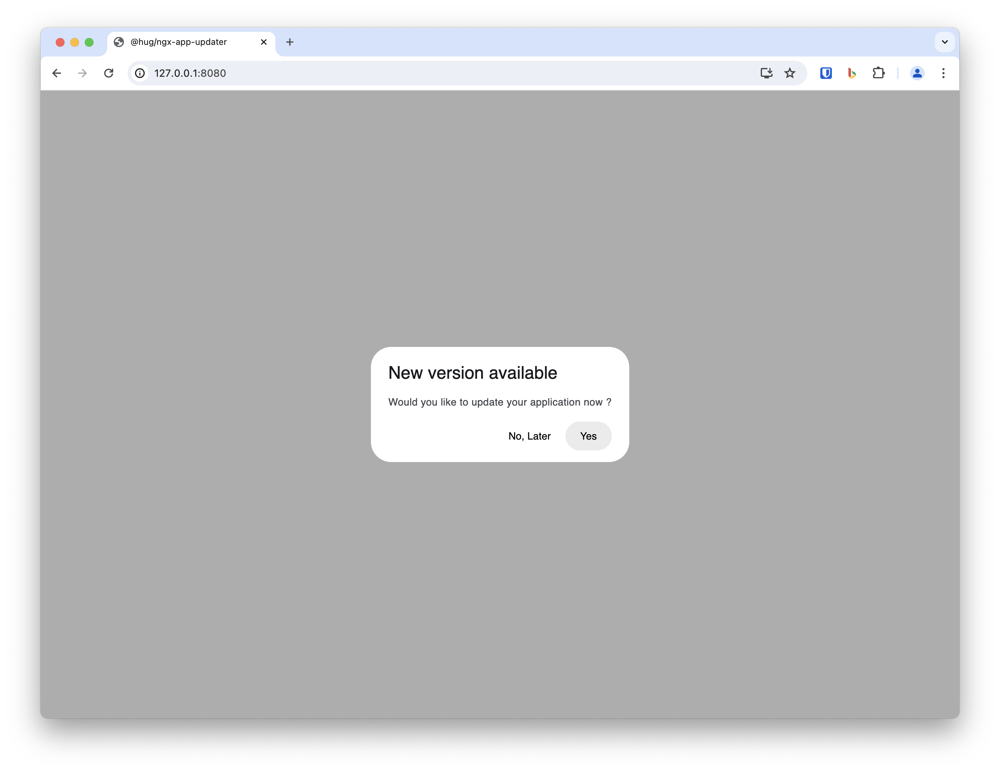
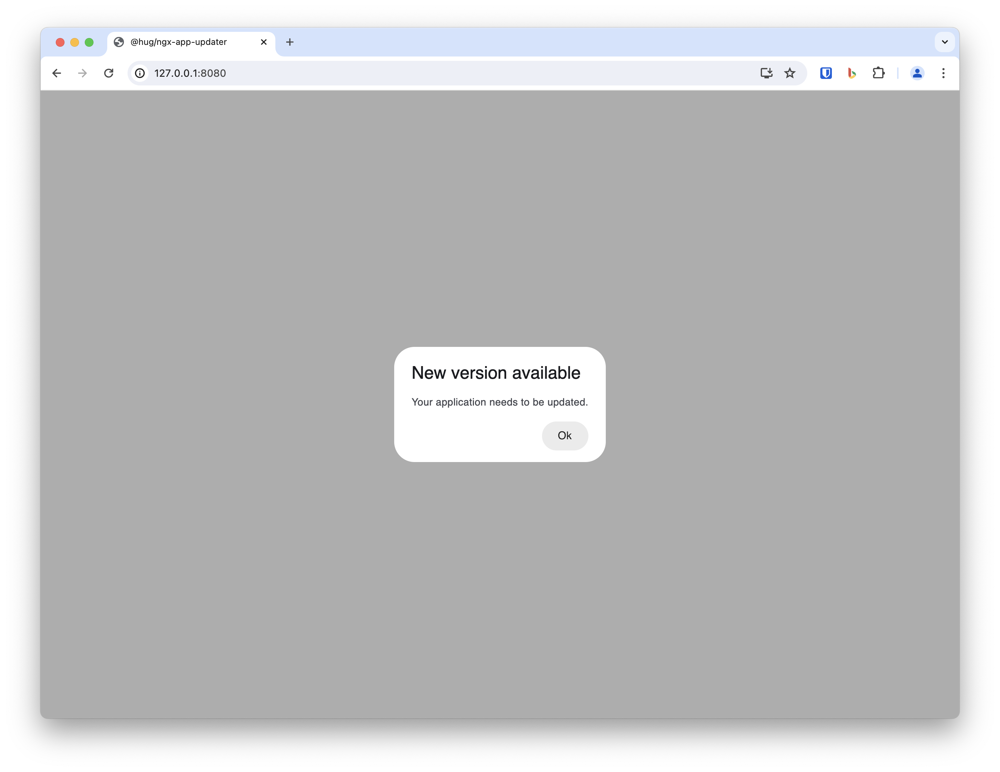
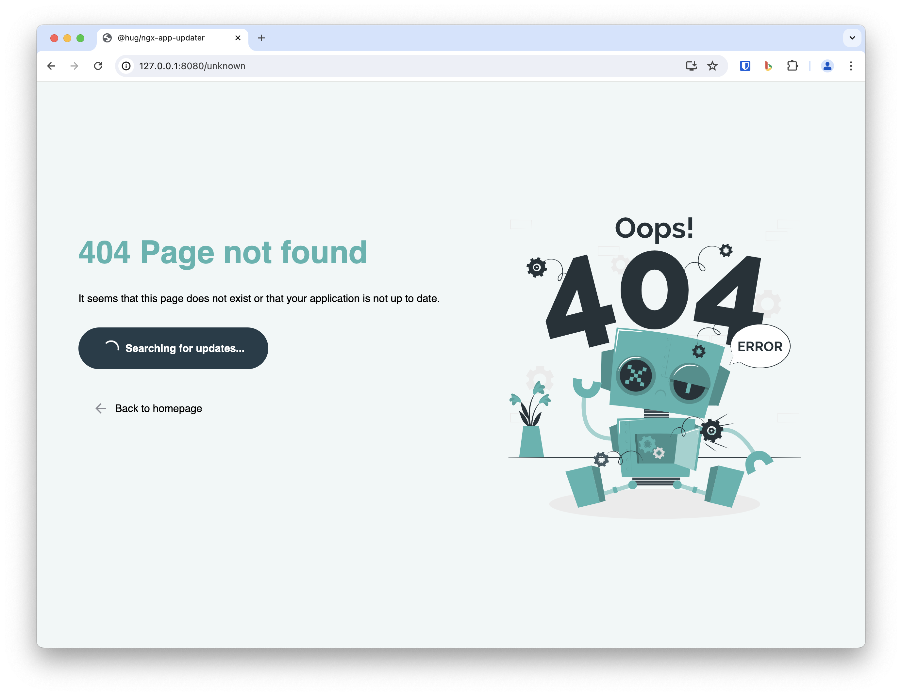
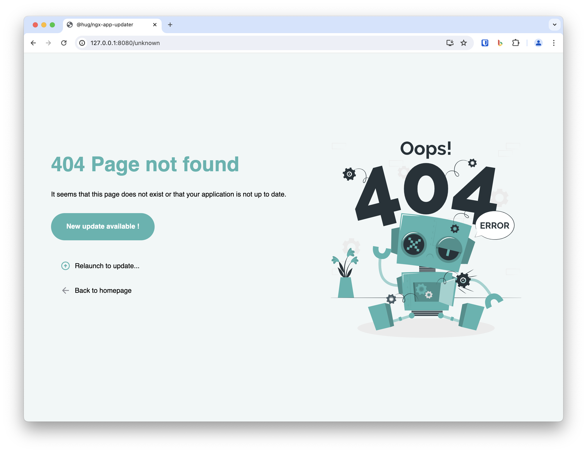

<h1 align="center">
    @hug/ngx-app-updater
</h1>

<p align="center">
    <br/>
    <a href="https://www.hug.ch">
        
    </a>
    <br/><br/>
    <i>Notify about Angular application's update</i>
    <br/><br/>
</p>

<p align="center">
    <a href="https://www.npmjs.com/package/@hug/ngx-app-updater">
        </a>
    <a href="https://npmcharts.com/compare/@hug/ngx-app-updater?minimal=true">
        </a>
    <a href="https://github.com/dsi-hug/ngx-app-updater/blob/main/LICENSE">
        </a>
</p>

<p align="center">
    <a href="https://github.com/dsi-hug/ngx-app-updater/actions/workflows/ci_tests.yml">
        </a>
    <a href="https://github.com/dsi-hug/ngx-app-updater/blob/main/CONTRIBUTING.md#-submitting-a-pull-request-pr">
        </a>
</p>

<hr/>


This library is a wrapper around the official [@angular/service-worker][angular-service-worker] library with extra functionalities and configurations.

It adds [Progressive Web App][pwa] supports and **updates notifications** to an Angular project.


## Getting started

To set up or update an Angular project with this library use the Angular CLI's [schematic][schematics] commands:

#### Installation

```sh
ng add @hug/ngx-app-updater
```

<details>
    <summary><i>More details</i></summary>

> <br/>
>
> The `ng add` command will ask you the following questions:
>
> 1.  **Allow user to cancel an update**: *whether a user can choose to cancel an update or not*
>
> And will also perform the following actions:
>
> -   Imports and registers the `service worker` in the application.
> -   Provide and initialize the `library`.
> -   Adds `icons` and `screenshots` files to support the installed PWA.
> -   Adds a `manifest.webmanifest` file.
> -   Adds a `ngsw-config.json` file.
> -   Updates the `index.html` to links the `manifest` and adds `theme-color` and `noscript` tags.

</details>


#### Update

```sh
ng update @hug/ngx-app-updater
```


## Features

### 🚀 Progressive Web App

* Adds `caching` and `offline` behaviors through `ngsw-config.json` file.
* Adds `icons` and `screenshots` files to support the installed PWA.
* Adds a `manifest.webmanifest` file.
* Updates the `index.html` to links the `manifest` and adds `theme-color` and `noscript` tags.


### 📣 Notification

When a new version of your application is deployed, this library will trigger a user notification to inform them that updates are available.

This is particularly useful to ensure that users who rarely close or refresh their web browsers are always running the latest version.

They can choose to update immediately, delay the update until a later time, or be forced to update.

By default, updates are checked every minute, and users are prompted about updates every day.

> TIP: in case `@angular/material` is also installed, the dialog will be themed accordingly.
> TIP: you can also provide your own dialog, following this [example][dialog-example] and using the `dialogOptions.component` option.

<p align="center">
    
    
</p>

#### Usage

Have a look at the [Options](#options) section to discover what can be customized.


### 4️⃣0️⃣4️⃣ Not found page

If a new route is to be released in a new version of your application, users that are still using an old version of the application will not be able to access that url on a first try.

To mitigate this behavior, this library provides a `404 page` that you could use to notify a user about a potential update.

Users will then be able to relaunch their application, apply the update and be presented with the new route.

> TIP: in case `@angular/material` is also installed, the page will be themed accordingly.
> TIP: you can also design your own 404 page following this [example][404-example].

<p align="center">
    
    
    
</p>

#### Usage

Have a look at the [Options](#options) section to discover what can be customized.

```ts
import { Routes } from '@angular/router';
import { HomePage } from './home.component';

export const routes: Routes = [
  { path: '', component: HomePage },
  {
    path: '**',
    pathMatch: 'full',
    loadComponent: () => import('@hug/ngx-app-updater/not-found').then(m => m.NgxAppUpdaterNotFoundPage)
  }
];
```


## Options

You shouldn't have to configure anything else but in case you wanted to, you can still do it.

The behavior of the library can be configured either in:

* `main.ts` *(if the app is a standalone Angular application)*
    ```ts
    bootstrapApplication(AppComponent, {
      providers: [
        provideAppUpdater(options?: NgxAppUpdaterOptions)
      ]
    });
    ```

* `app.module.ts` *(if the app is **not** a standalone Angular application)*
    ```ts
    @NgModule({
      imports: [
        NgxAppUpdaterModule.forRoot(options?: NgxAppUpdaterOptions)
      ]
    })
    export class AppModule { }
    ```


## Development

See the [developer docs][developer].


## Contributing

#### > Want to Help?

Want to file a bug, contribute some code or improve documentation? Excellent!

But please read up first on the guidelines for [contributing][contributing], and learn about submission process, coding rules and more.

#### > Code of Conduct

Please read and follow the [Code of Conduct][codeofconduct], and help us keep this project open and inclusive.


## Credits

Copyright (C) 2021 [HUG - Hôpitaux Universitaires Genève][dsi-hug]

[][dsi-hug]


[pwa]: https://web.dev/progressive-web-apps/
[angular-service-worker]: https://angular.io/guide/service-worker-intro
[dialog-example]: https://github.com/DSI-HUG/ngx-app-updater/tree/main/projects/lib/core/dialog/content
[404-example]: https://github.com/DSI-HUG/ngx-app-updater/tree/main/projects/lib/not-found
[schematics]: https://angular.io/guide/schematics-for-libraries
[developer]: https://github.com/dsi-hug/ngx-app-updater/blob/main/DEVELOPER.md
[contributing]: https://github.com/dsi-hug/ngx-app-updater/blob/main/CONTRIBUTING.md
[codeofconduct]: https://github.com/dsi-hug/ngx-app-updater/blob/main/CODE_OF_CONDUCT.md
[dsi-hug]: https://github.com/dsi-hug
